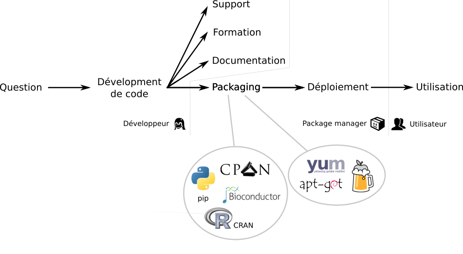
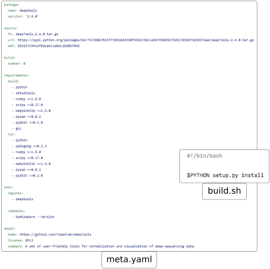

Comment fixer les problèmes de déploiement et de durabilité des outils en bioinformatique ?
======

Actuellement, des données biologiques sont générées à des vitesses folles pour répondre aux questions posées par les chercheurs. La diversité des questions entraine une diversité des données : génomiques, images, _etc_. Pour manipuler les données et extraire les informations utiles, des solutions et outils bioinformatiques sont nécessaires. De nombreux outils existent déjà pour répondre à de nombreuses questions. Mais parfois, des nouveaux outils sont nécessaires pour répondre à une question spécifique. Intervient alors le développement d'un nouvel outil bioinformatique.

# Développer et distribuer un outil bioinformatique

Lorsque vous développez un outil bioinformatique, vous le faites dans le but premier de répondre à une question. Une fois celle-ci correctement formulée, vous choisissez votre méthode de travail et les outils ([1](http://bioinfo-fr.net/the-bio-code-guide-du-bon-bioinformaticien) [2](http://bioinfo-fr.net/introduction-sur-les-bonnes-pratiques-de-developpement)) qui vous aiderons à bien gérer votre projet. Par exemple, si vous avez choisi Java pour développer votre projet, il se peut que vous utilisiez [Git](http://bioinfo-fr.net/git-premiers-pas) comme gestionnaire de versions et [Maven](https://maven.apache.org/guides/getting-started/maven-in-five-minutes.html) comme gestionnaire de _build_.

Vous avez donc écrit du code source. Pour partager votre solution, vous allez écrire de la documentation, faire de la formation et du support autour de l'outil. Et vous pouvez être amené à le publier pour expliquer votre méthode (sinon, ce n'est pas de la science reproductible, donc pas de la science, et tac !). Il vous faut alors distribuer votre programme. Cela peut être fait de bien des façons :

- [en imprimant le code (PDF)](http://api.rue89.nouvelobs.com/sites/news/files/assets/document/2016/10/algorithme.pdf) (Ceci est un troll)
- sous la forme d'un [espace web dédié](https://blast.ncbi.nlm.nih.gov)
- via une plateforme de partage de code source, avec les instructions pour utiliser la solution

Le partage des sources est primordial pour assurer la transparence, mais il peut être particulièrement difficile d'installer correctement un logiciel (multitude de dépendances, incompatibilité entre des versions, _etc_). Le constat est simple : si votre algorithme est révolutionnaire mais que personne ne peut l'utiliser, "je ne lui prédis pas un grand avenir" (#OSS117).


Cette voie fonctionne bien lorsque l'outil est simple et ne dépend pas de trop nombreux autres outils. Cependant, la phase de déploiement reste à la charge de l'utilisateur (ou de l'administrateur système du labo). Et le déploiement d'un logiciel est la proie de deux grands fléaux :

- les dépendances manquantes (OHMYGOD!)
- les versions des dépendances (I'MGONNADIE!!)

Il s'en suit alors un casse-tête dantesque où l'utilisateur doit installer impeccablement _TOUTES_ les bonnes versions de _TOUTES_ les dépendances (si on peut encore les trouver et si elles sont compatibles avec son système, évidemment). __A LA MAIN !__ C'est évidemment une source colossale de fausse manip' et de découragement pour l'utilisateur, qui préfèrera alors se tourner vers une solution alternative.

Nous sommes donc face à un double problème de durabilité des outils et de leur déploiement. Ceux-ci ont des impacts importants sur la productivité et la reproductibilité en sciences. Il devient donc urgent de résoudre ces deux questions et rendre la bioinformatique meilleure !

# Faciliter le déploiement d'un logiciel

Les problèmes précédemment cités sont une chose que les utilisateurs de systèmes Linux/OSX ne connaissent qu'à moitié, puisque rares sont ceux qui installent tout à la main. Le commun des mortels utilise, quand il le peut, un gestionnaire de paquets. Il en existent plusieurs étant pour la plupart spécifique :

- à un langage ([pip]() pour Python, [CPAN]() pour Perl, [CRAN]() pour R, _etc_)
- à un système d'exploitation ([yum]() pour Fedora, [APT]() pour Debian, [howebrew]() pour OSX, _etc_)



Le packaging demande un petit effort de la part du développeur, mais le déploiement de l'outil derrière le code est grandement facilité. L'utilisateur n'a à se préoccuper que de la partie "utilisation" (ce qui est somme toute plutôt logique). Pour que tout soit parfait, il est également nécessaire de documenter le logiciel, de proposer des formations, du support et d'en faire la publicité.

# La solution à tous nos maux : Conda

Pour qu'un outil soit utilisé, il doit être facilement déployable n'importe où. Pour cela, il faut le packager avec un gestionnaire de paquets qui soit :

- indépendant d'un langage de programmation : Des outils bioinformatiques sont disponibles dans pratiquement tous les langages disponibles
- indépendant du système d'exploitation : Les outils sont utilisés sur les principaux systèmes d'exploitation
- indépendant de privilèges super utilisateurs : Certains utilisateurs n'ont pas les droits d'administration de leur ordinateur
- capable de gérer plusieurs versions d'outils : Des versions différentes d'un outil peuvent être requises par différents outils
- compatible avec une utilisation sur le Cloud ou en environnement HPC

[Conda](https://conda.io/docs/intro.html) est un gestionnaire de paquets open-source qui répond très bien à ces problématiques. Bien que développé par la communauté PyData, conda est conçu pour gérer des paquets et dépendances de n'importe quel programme dans n'importe quel langage. Conda est donc moins `pip` qu'une version multi-système d'exploitation de `apt` et `yum`.

Un paquet conda correspond à un fichier tarball contenant des librairies au niveau système, Python ou d'autres modules, des programmes exécutables ou d'autres composants. En distribuant des outils précompilés, l'installation de paquet conda est rapide, robuste et facile:

```bash
$ conda install deeptools
```

## Les principales fonctionnalités de conda

Conda permet donc de gérer différents logiciels, un peu à la manière de `apt` du point de vue de l'utilisateur. On retrouve les commandes suivantes :

``` bash
$ conda list               # lister les paquets installés
$ conda search deeptools   # rechercher les paquets qui pourraient correspondre à "deeptools"
$ conda install deeptools  # installer le paquet "deeptools"
$ conda update deeptools   # mettre à jour (si possible) le paquet "deeptools"
$ conda remove deeptools   # supprimer le paquet "deeptools"
$ conda help               # vous laisser découvrir toute la beauté de conda
```

Conda garde une trace des dépendances entre les paquets et les plateformes. Par exemple, `deeptools` a besoin de `python`, `numpy 1.9.0+` et `scipy 0.17.0+` entre autres. Conda se charge d'installer ou mettre à jour ses dépendances si besoin, ainsi que les dépendances de ces dépendances, _etc_.

Conda vient aussi avec une gestion d'__environnements virtuels__, sur le même principe que les environnements virtuels de Python. Un [environnement conda](https://conda.io/docs/using/envs.html) est un dossier contenant une collection spécifique de paquets conda installés mais isolés des autres environnements conda. Ce principe permet l'installation et la gestion de plusieurs versions d'outils, comme Python 2.7 et Python 3.5 par exemple. Vous pouvez alors créer des environnements dédiés qui assureront la reproductibilité de vos analyses.

Encore des réticences vis à vis de Conda ? Je vous conseille de lire ce [blog post](https://jakevdp.github.io/blog/2016/08/25/conda-myths-and-misconceptions/) sur les mythes et fausses idées liées à Conda.

## Les _channels_

En bon gestionnaire de paquets, conda offre la possibilité d'ajouter d'autres sources de paquets, aussi appelées _channels_. Les outils assez généralistes peuvent être trouvé dans le channel *default* ou [*conda-forge*](https://conda-forge.github.io/). Spécialisé dans les outils bioinformatiques, le *channel* [Bioconda](https://bioconda.github.io) consiste en :

- Un [dépôt GitHub](https://github.com/bioconda/bioconda-recipes) de recettes
- Un système de construction qui transforme ces recettes en paquets conda
- Un répertoire de plus de [2 000 paquets bioinformatiques](https://bioconda.github.io/recipes.html) prêt à être utilisés

Avec presque 200 contributeurs, cette communauté accueillante et formée il y a un peu plus de 1 an grossit rapidement. Elle ajoute, modifie, met à jour et maintient les nombreuses recettes des paquets conda d'outils bioinformatiques existant, mais vous donnera aussi tout un tas de conseils pour parfaire vos recettes.

## Packager un logiciel

Envie d'écrire un paquet conda pour un outil existant ? On pourrait penser que cela est difficile étant donnés les avantages apportés par conda. Mais au contraire, l'écriture de paquets conda a été pensée pour être facile et permettre ainsi à tous d'intégrer les outils dans conda avec une [documentation extensive](https://conda.io/docs/building/build.html). Ainsi, un paquet conda consiste en deux fichiers :

- Un fichier `meta.yaml` contenant les méta-données du paquet : nom, où trouver les sources de l'outil, dépendances de l'outil, ...
- Un fichier `build.sh` pour expliquer comment conda doit créer le paquet



Bioconda propose [un guide](https://bioconda.github.io/contributing.html) pour écrire des recettes qui seront par la suite intégrées.

## Bioconda va même encore plus loin !

Pour faciliter le déploiement tout en suivant les besoins évoqués précédemment, un autre moyen de packager un outil est de le _containeriser_. La containerisation la plus connues est [Docker](https://www.docker.com/), mais il existe d'autres solutions comme [rkt](https://github.com/coreos/rkt) ou [Singularity](http://singularity.lbl.gov/). Ces containers permettent d'obtenir un plus haut niveau d'abstraction pour un outil par rapport au système de base.

La création de containers pour un outil est plus complexes que pour créer un paquet conda. Par exemple, pour créer un container Docker, il faut créer un fichier *Dockerfile* décrivant l'image de base utilisée, les commandes pour créer l'outil, ...

[Mulled](https://github.com/mulled/mulled) est un projet permettant de générer un container ([BioContainer](http://biocontainers.pro/)) minimal pour Docker ou rkt à partir d'un paquet conda, alpine or linuxbrew. Il faut seulement ajouter un ligne dans un fichier TSV pour indiquer à Mulled de créer le container.


Pour des paquets Bioconda, c'est encore plus facile : il n'y a rien à faire. Mulled parcourt tous les paquets Bioconda quotidiennement et génère des BioContainers automatiquement pour tous les paquets Bioconda.

En packageant les outils avec conda au sein de Bioconda, on limite le problème de déploiement des outils aux utilisateurs. Les outils deviennent facilement déployables avec plusieurs solutions : _via_ les paquets conda ou via des BioContainer construits automatiquement.

# La durabilité et disponibilité

Un outil peut dépendre de nombreux autres outils, qui peuvent ne plus être maintenus ni même disponibles. L'indisponibilité des outils posent de nombreux problèmes dont ceux de reproductibilité et durabilité.

Pour résoudre ces problèmes, l'idéal serait d'avoir un stockage permanent de toutes les versions des paquets et outils utilisés pour qu'ils soient toujours accessibles.

La reproductibilité et l'accessibilité font partis des mantras du projet [Galaxy](https://galaxyproject.org/). Ainsi, pour répondre aux problèmes de disponibilité et de durabilité des outils et paquets, la communauté autour de Galaxy a mis en place [Cargo Port](https://depot.galaxyproject.org/software/), un répertoire public pour archiver de nombreux paquets de façon stable et permanente.

Ajouter un paquet dans ce dépôt est facile. Il suffit d'ajouter une ligne dans un fichier TSV avec les informations (nom et URL) sur le paquet à stocker. Pour les paquets créés avec Bioconda, c'est même encore plus facile : il n'y a rien à faire. Cargo Port fait des archives journalières des recettes et paquets Bioconda, et permet ainsi de fixer le problème de durabilité et disponibilité des outils.

# Déploiement et durabilité des outils en bioinformatique : Fixés !

Le développement des paquets Bioconda est très facile et facilite le packaging et le déploiement de tout outil bioinformatique. Avec le projet Mulled, des containers Linux efficaces sont automatiquement construits pour tous paquets Bioconda pour permettre un plus haut niveau d'abstraction et d'isolation par rapport au système de base. C'est un super effort de différentes communautés pour créer un système flexible et extensible et fixer ainsi le problème de déploiement une fois pour toute.

L'interface avec paquets Bioconda avec Cargo Port améliore la disponibilité et la durabilité en conservant toutes les sources.


J'espère vous avoir convaincu que grâce à ces projets collaboratifs, leur communauté et leurs collaborations, les outils bioinformatiques peuvent être facilement packagés et être toujours disponibles pour leurs utilisateurs. La seule chose à faire est de créer une recette Bioconda et rendre ainsi vos utilisateurs heureux et leurs (et vos) analyses efficaces et reproductibles !
