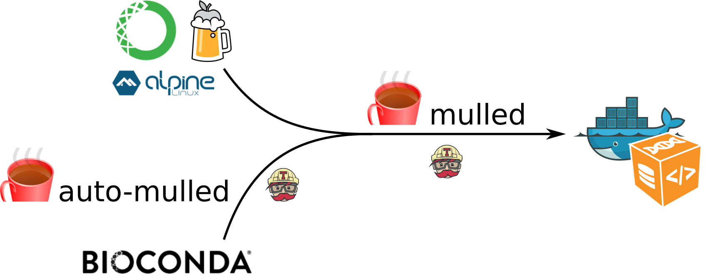

Comment fixer les problèmes de déploiement et de durabilité des outils en bioinformatique?
======

Actuellement, des données biologiques massives sont générées pour répondre aux questions posées par les chercheurs. Ces données sont très diverses: données génomiques, images, etc, tout comme les questions. Pour manipuler les données et extraire les informations utiles, des solutions et outils bioinformatiques sont nécessaires. De nombreux outils existent déjà pour répondre à de nombreuses questions. Mais parfois, des nouveaux outils sont nécessaires pour répondre à une question spécifique. Intervient alors le développement d'outils bioinformatique. 


# Comment développer un outil bioinformatique? Le chemin idéal

Lorsque vous développez un outil bioinformatique, vous le faites dans le but premier de répondre à une question. Du code source peut être généré (dans n'importe quel langage). Ce code source peut être distribué et déployé tel quel, ce qui est facile lorsque l'outil est simple, avec peu de dépendance et déployé localement. 

Pour faciliter le déploiement et l'utilisation de l'outil, le code peut être packagé grâce à un gestionnaire de paquets. De nombreux gestionnaire de paquets existent: spécifiques à un langage ([pip](), [CPAN](), [CRAN](), etc), spécifiques à un système d'exploitation ([yum](), [apt-get](), etc), etc. Une fois packagé, l'outil derrière le code peut ainsi être faciliment déployé et utilisés par les utilisateurs ciblés. 

Pour aider les utilisateurs, répandre l'outil et en faire la publicité, de la documentation, de la formation et du support doivent aussi être fournis. 


Question, développement de code source, packaging, déploiement, documentation, formation et support forment la voie idéal de développemet d'un outil en bioinformatique.

Cette voie royale fonctionne bien lorsque l'outil est simple et ne dépend pas de trop nombreux autres outils. 

Qui n'a jamais eu à faire avec une dépendance manquante? La dépendance peut ne plus être disponible pour de nombreuses raisons : non maintenue, serveur de stockage éteint, ... Nous sommes donc face à un problème de durabilité des outils. Il y a aussi les nombreux problèmes de déploiement de certaines versions d'outils: non disponible pour un sytème d'exploitation ou pour certaines versions de certains systèmes d'exploitation. 

Ces deux problèmes de déploiement et durabilité des outils ont des impacts importants sur la productivité et la reproductibilité en sciences. Il devient donc urgent de résoudre ces deux questions et rendre la bioinformatique meilleure!

# Le déploiement

Pour qu'un outil soit utilisé, il doit être facilement déployable n'importe où. Pour cela, il faut le package avec un gestionnaire de paquets qui soit :

- Indépendant d'un langage de programmation : Des outils bioinformatiques sont disponibles dans pratiquement tous les langages disponibles
- Indépendent du système d'exploitation : Les outils sont utilisés sur les principaux systèmes d'exploitation
- Indépendant de privilèges super utilisateurs : Certains utilisateurs n'ont pas les droits d'administration de leur ordinateur
- Capable de gérer plusieurs versions d'outils : Des versions différentes d'un outil peuvent être requises par différents outils
- Compatible avec une utilisation sur le Cloud ou en environnement HPC

[conda](https://conda.io/docs/intro.html) est un gestionnaire de paquets open-source qui répond très bien à ces problématiques. Bien que développé par la communauté PyData, conda est conçu pour gérer des paquets et dépendances de n'importe quel programme dans n'importe quel langage. conda est donc moins `pip` qu'une version multi système d'exploitation de `apt` et `yum`.

Un paquet conda correspond à un fichier tarball contenant des librairies au niveau système, Python ou d'autres modules, des programmes exécutables ou d'autres composants. En distribuant des outils précompilés, l'installation de paquet conda est rapide, robuste et facile : 

```
$ conda install deeptools
```

conda garde une trace des dépendances entre les paquets et les plateformes. conda vient aussi avec une application de gestion d'environnement, sur le même principe que les environnements virtuels de Python. Un [environnement conda](https://conda.io/docs/using/envs.html) est un dossier contenant une collection spécifique de paquets conda installés. Ce principle permet de gérer l'installation et la gestion de plusieurs versions d'outils, comme Python 2.7 et Python 3.5 par exemple.

Encore des résistances vis à vis de Conda? Je vous conseille de lire ce [blog post](https://jakevdp.github.io/blog/2016/08/25/conda-myths-and-misconceptions/) sur les mythes et fausses idées liées à Conda. 

Envie d'écrire un paquet conda pour un outil ? On pourrait penser que cela est difficile étant donnés les avantages apportés par conda. Mais au contraire, l'écriture de paquets conda a été pensée pour être facile et permettre ainsi à tous d'intégrer les outils dans conda avec une [documentation extensive](https://conda.io/docs/building/build.html). Ainsi, un paquet conda consiste en deux fichiers : 

- Un fichier YAML contenant les méta-données du paquet : nom, où trouver les sources de l'outil, dépendances de l'outil, ... 
- Un fichier BASH pour expliquer comment conda doit créer le paquet


Les *channels* sont les chemins que prend conda pour chercher des paquets. Les outils assez généralistes peuvent être trouvé dans le channel [*conda-forge*](https://conda-forge.github.io/). Spécialisés dans les outils bioinformatiques, le *channel* [Bioconda](https://bioconda.github.io) est consiste en :

- Un [dépôt GitHub](https://github.com/bioconda/bioconda-recipes) de recettes
- Un système de construction qui transforme ces recettes en paquet conda
- Un répertoire de plus de 2 000 paquets bioinformatiques prêt à être utilisés

Avec resque 200 contributeurs, cette communauté accueillante et formée il y a un peu plus de 1 an grossit rapidement. Elle permet d'ajouter, modifier, mettre à jour et maintenir les nombreuses recettes des paquets conda d'outils bioinformatiques. 

Pour faciliter le déploiement tout en suivant les besoins évoqués précédemment, un autre moyen de packager un outil est de le containeriser. La containerisation la plus connues est [Docker](https://www.docker.com/), mais il existe d'autres solutions comme [rkt](https://github.com/coreos/rkt) ou [Singularity](http://singularity.lbl.gov/). Ces containeurs permettent d'obtenir un plus haut niveau d'abstraction du système de base pour un outil. 

La création de containeurs pour un outil est plus complexes que pour créer un paquet conda. Par exemple, pour créer un containeur Docker, il faut créer un fichier *Dockerfile* décrivant l'image de base utilisées, les commandes pour créer l'outil, ...

[Mulled](https://github.com/mulled/mulled) est un projet permettant de générer un containeur minimal pour Docker avec [BioContainer](http://biocontainers.pro/) ou rkt à partir d'un paquet conda, alpine or linuxbrew. Il faut seulement ajouter un ligne dans un fichier TSV pour indiquer à Mulled de créer le containeur. 



Pour des paquets Bioconda, c'est encore plus facile : il n'y a rien à faire. Mulled parcourre tous les paquets Bioconda tous les jours et génère des BioContainer automatiquement pour tous les paquets BioConda.


En packageant les outils avec conda au sein de Bioconda, on résoud le problème de déploiement des outils. Les outils deviennent facilement déployable via les paquets conda ou via des BioContainer construits automatiquement.

# La durabilité et disponibilité

Un outil peut dépendre de nombreux autres outils, qui peuvent ne plus être maintenus ou même disponibles. Ce problème de disponibilité des outils posent de nombreux problèmes dont celui de reproductibilité et durabilité. 

Pour résoudre ces problèmes, l'idéal serait d'avoir un stockage permanent de toutes les versions des paquets et outils utilisés pour qu'ils soient toujours accessibles. 

La reproducibilité et l'accessibilité sont des causes qui tiennent à coeur à la communauté autour du projet [Galaxy](https://galaxyproject.org/). Ainsi, pour répondre au problème de disponibilité et de durabilité des outils et paquets, la communauté a mis en place [Cargo Port](https://depot.galaxyproject.org/software/), un répertoire public pour archiver de nombreux paquets de façon stable et permanente. 

Ajouter un paquet dans ce dépôt est facile. Il suffit d'ajouter une ligne dans un fichier TSV avec les informations (nom et URL) sur le paquet à stocker. Pour les paquets créés avec Bioconda, c'est même encore plus facile : il n'y a rien à faire. Cargo Port fait des archives journalières des recettes et paquets Bioconda.


Avec la sauvegarde automatique des paquets Bioconda au sein de Cargo Port, le problème de durabilité et disponibilité des outils est fixé.

# Déploiement et durabilité des outils en bioinformatique: Fixés !

Le développement des paquets Bioconda est très facile et facilite le packaging et le déploiement de tout outil bioinformatique. Avec le projet Muller, des containeurs Linux efficaces sont automatiquement construits pour tous paquets conda pour permettre un plus haut niveau d'abstraction et d'isolation par rapport au système de base. C'est un super effort de différentes communautés pour créer un système flexible et extensible pour fixer le problème de déploiement une fois pour toute.

L'interface avec paquets Bioconda avec Cargo Port améliore la disponibilité et la durabilité en conservant toutes les sources.


J'espère vous avoir convaincu que grâce à ces projets collaboratifs, leur communauté et leurs collaborations, les outils bioinformatiques peuvent être facilement packagé et être toujours disponibles pour leurs utilisateurs. La seule chose à faire est de créer une recette Bioconda et rendre ainsi vos utilisateurs heureux et leurs (et vos) analyses efficaces et reproductibles !